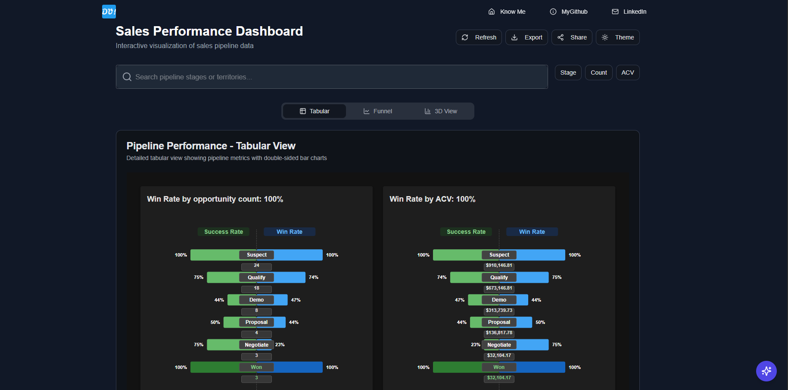
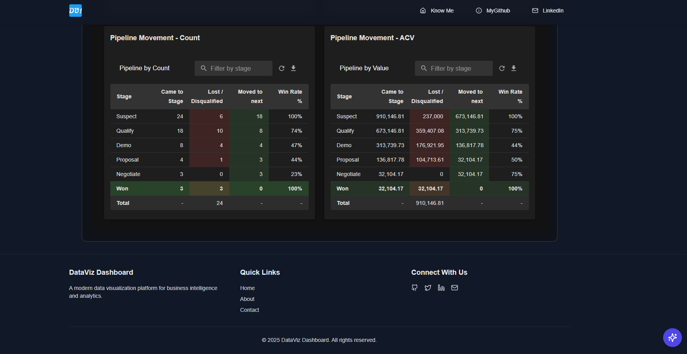
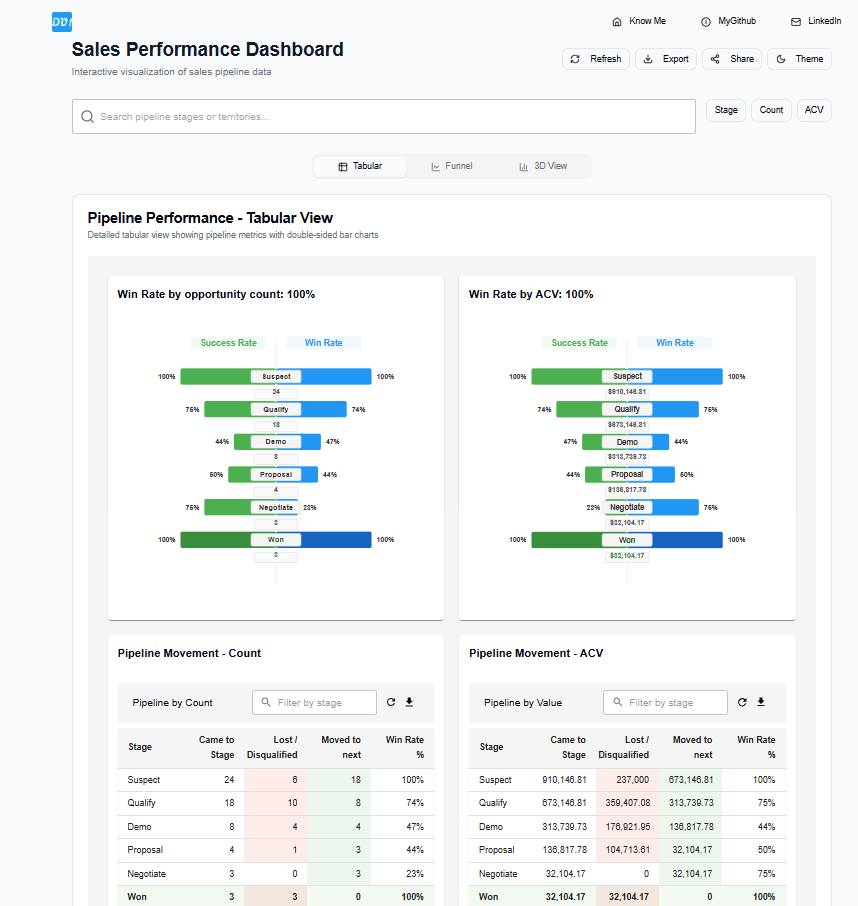
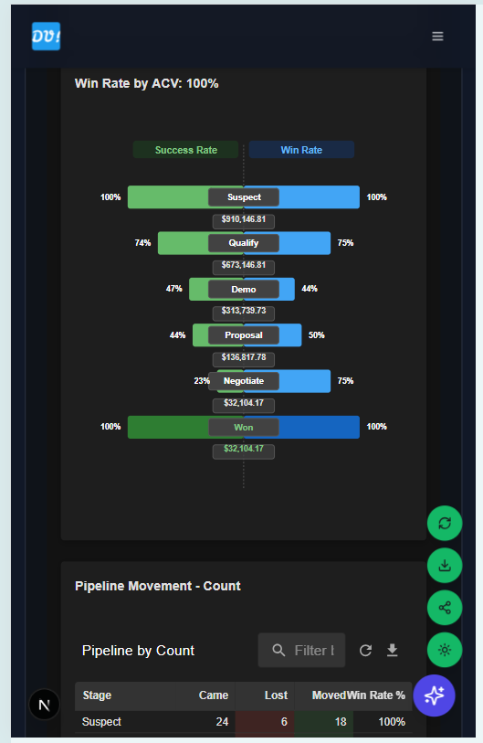
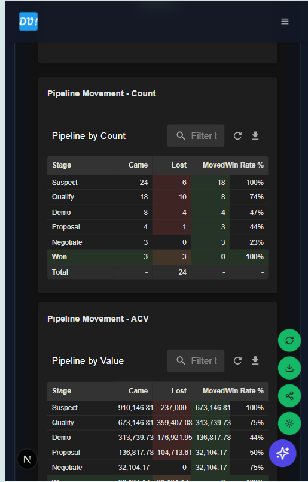
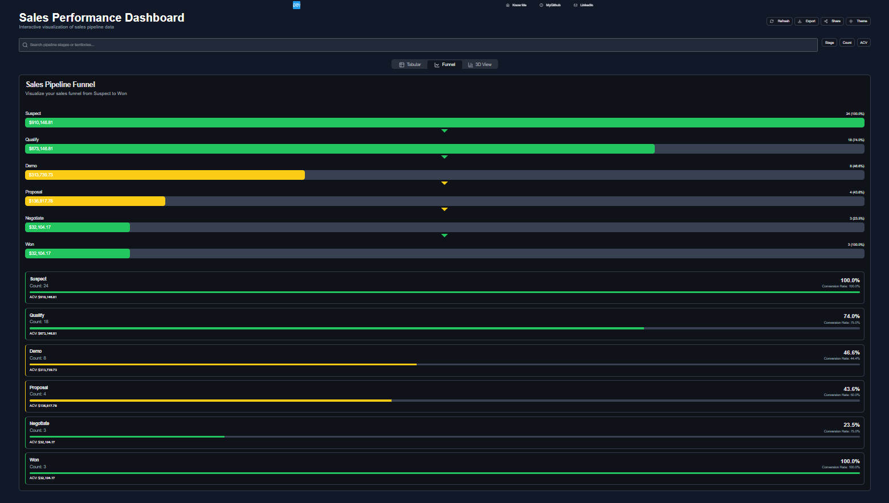
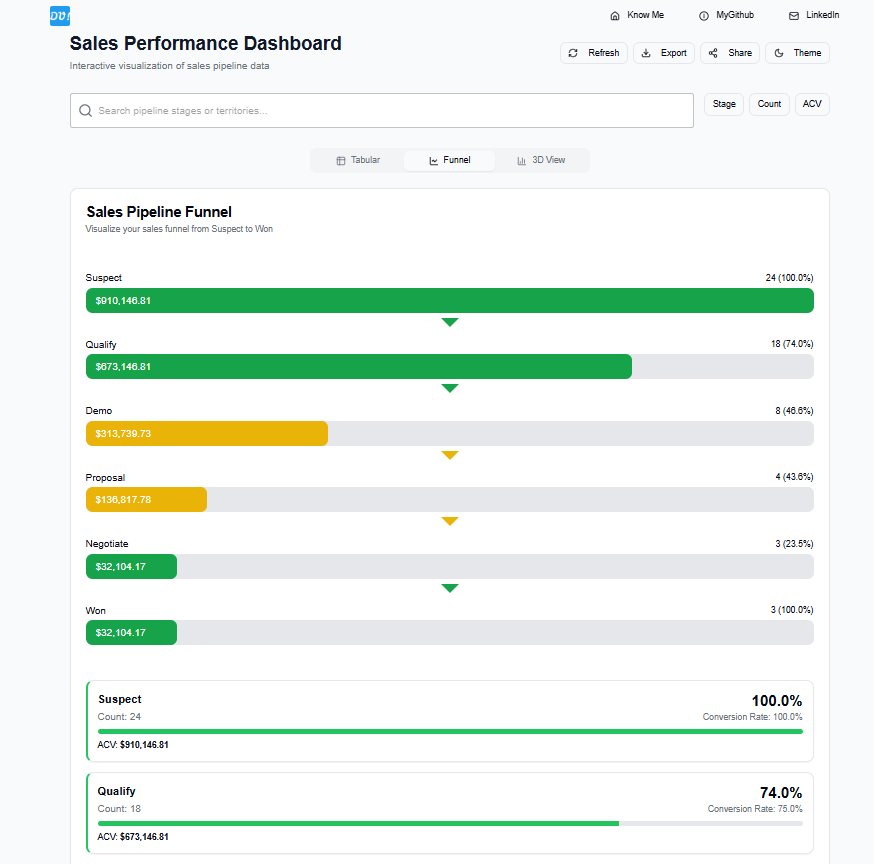
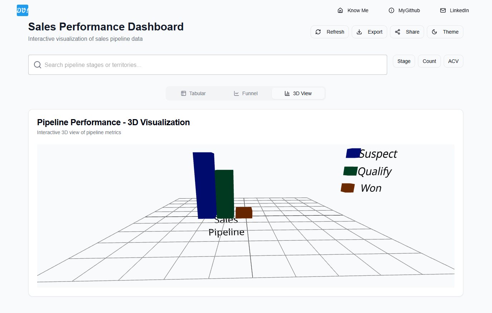
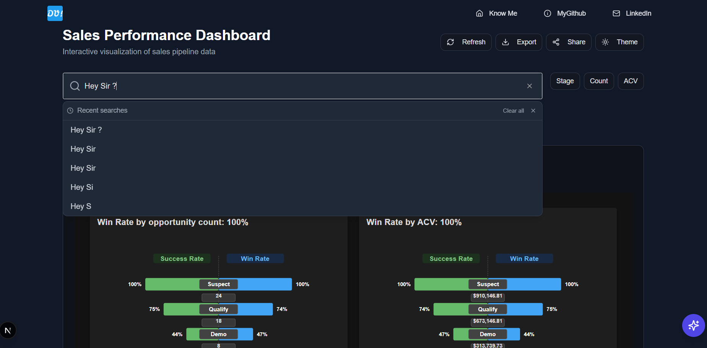
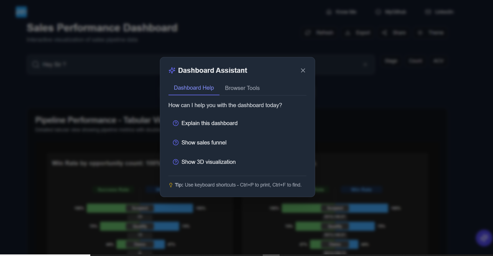

# 📊 DataViz Dashboard



**DataViz Dashboard** is an interactive, modern data visualization platform built using **Next.js**, **React**, **Material UI**, and **D3.js**. It offers intuitive views of a sales pipeline through multiple visual formats—tabular tables, funnel charts, and stunning 3D visuals.

> 🔗 **[Live Demo](https://dv-hirez.vercel.app/)**  
> 🧠 Designed for responsiveness, interactivity, and clarity  
> 🛠️ Built with a scalable, component-driven architecture

---

## ✨ Key Features

### 📈 Multiple Visualization Modes

#### Tabular View
- Sortable columns  
- Filterable rows  
- CSV export  
- Responsive layout

📸 *Screenshot (Desktop)*  
)  



📸 *Screenshot (Mobile)*  
)



---

#### Funnel Chart
- Built with D3.js  
- Smooth animations  
- Shows conversions between sales stages

📸 *Screenshot (Tablet)*  
 

📸 *Screenshot (4K)*  


---

#### 3D Visualization
- Rendered using Three.js + React Three Fiber  
- Orbit controls for interaction  
- Adaptive to GPU capability

📸 *Screenshot (Mobile Landscape)*  


---

### 🔍 Data Interaction
- 🔎 Real-time search with history
- 🔃 Multi-level sorting
- 📤 One-click data export
- 🔗 Filters synced across all views

---

## 🖥️ Fully Responsive Design

Whether you’re on a phone, tablet, laptop, or a 4K monitor—DataViz Dashboard looks **great everywhere**.

📸 *All device screenshots here*  
- 📱 Mobile  
- 💻 Laptop/Desktop  
- 🖥️ 4K UHD  
- 📲 Tablet

---

## 🎨 Beautiful & Accessible UI

- 🌗 Dark / Light mode support  
- ⚡ Smooth transitions with Framer Motion  
- ♿ Keyboard-friendly & screen reader ready  

📸 *Dark Mode Example*  


---

## 🧙‍♂️ Genie Assistant

Your AI guide to navigate the dashboard easily  
- 💬 Natural language queries  
- 🧭 Quick actions and tips  

📸 *Genie Assistant Preview*  


---

## ⚙️ Technology Stack

| Category            | Tech Used |
|---------------------|-----------|
| Frontend Framework  | Next.js, React 18 |
| UI Components       | Material-UI, Tailwind CSS |
| Charts & Graphs     | D3.js, Recharts, Three.js |
| Animations          | Framer Motion |
| State Management    | Redux Toolkit |
| Theming             | `next-themes` |

---

## 🧱 Architecture & Implementation

- **Redux Slices**:  
  - `dataSlice`: handles API and filters  
  - `uiSlice`: theme, sidebar, tabs  
  - `searchSlice`: query & history

- **Visualization Components**:  
  - `FunnelChart.tsx`  
  - `bar-chart-3d.tsx`  
  - `PipelineTable.tsx`

- **Performance Tactics**:  
  - Code splitting + lazy loading  
  - Memoization of expensive components  
  - WebGL fallback detection

---

## 📥 Getting Started

```bash
git clone https://github.com/Pj-develop/DashViz
cd DashViz
npm install
npm run dev
```

Then visit: [http://localhost:9002](http://localhost:9002)

---

## 🔄 Future Enhancements

- ⏱️ Real-time data updates  
- 🧑‍💼 Authentication & user-specific views  
- 📊 New chart types  
- 📄 PDF / Excel export  
- 📦 Scale to handle large datasets

---

## 📄 License

MIT License © [Priyanshu Jha]

---

## 🙋‍♂️ Contributors

- [Priyanshu Jha](mailto:priyanshu.j@hotmail.com)
